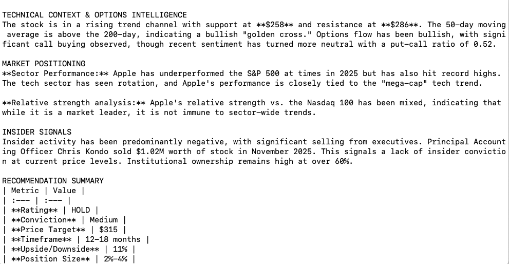

# Gemini Quant: Deep Market Analysis

**Gemini Quant** is a financial analysis tool designed to transform Gemini CLI into a research analyst.

You can use it free with Gemini CLI! No API keys, no token payments, no subscriptions.

---

## AI Investor: Deep Market Analysis

The core of this repository is the **AI Investor** engine—a research framework that directs Gemini to perform multi-layered market analysis. Unlike simple summarizers, this system executes a rigorous due diligence process.

### Installation

#### Step 1: Install Gemini CLI

First, you need to install the official Gemini CLI. Follow the instructions in the [official Gemini CLI repository](https://github.com/google-gemini/gemini-cli).


#### Step 2: Clone this Repository

```bash
git clone https://github.com/lopushok9/gemini_quant.git
cd gemini_quant
```

#### Step 3: Install the Extension in Gemini CLI

Navigate to the `ai-investor` folder and install it as a Gemini extension:

```bash
cd ai-investor
gemini extension install .
```

Verify the installation:
```bash
gemini extension list
```

You should see `ai-investor` in the list of installed extensions.

---

### Available Commands

Once installed, you can use these commands directly in your terminal, it may take a while to load up to 3 minutes (run commands from the ai-investor folder):

| Command | Description | Example |
|---------|-------------|---------|
| `gemini analyze [TICKER]` | **Long-term investment analysis**. Generates a full research report with BUY/SELL/HOLD rating, price targets, risk assessment. | `gemini analyze AAPL` |
| `gemini analyze-st [TICKER]` | **Short-term trading analysis**. Focuses on technical indicators, momentum, and near-term catalysts for swing trading. | `gemini analyze-st TSLA` |
| `gemini analyze-lev [TICKER]` | **Leveraged trading analysis**. Evaluates assets for short-term leveraged positions with specific entry/exit points. | `gemini analyze-lev BTC` |
| `gemini poly-s` | **Polymarket Scanner**. Scans the top Finance & Economy markets for high-potential trading opportunities. | `gemini poly-s` |
| `gemini poly [TOPIC]` | **Polymarket Analysis**. Deep dive into a specific prediction market to find +EV opportunities. | `gemini poly "Bitcoin price"` |


---

### Research Methodology

The agent follows a strict 3-pillar investigative strategy:

1.  **Financial Performance**
    *   Deep dive into revenue growth, margins, and key business KPIs.
    *   Analysis of earnings reports and analyst coverage.

2.  **Market Positioning**
    *   Peer comparison with valuation multiples (P/E, P/S).
    *   Sector performance and competitive analysis.

3.  **Advanced Intelligence**
    *   **Technical Context**: Support/resistance levels, volume patterns.
    *   **Options Flow**: Put/call ratios, implied volatility trends.
    *   **Insider Signals**: Tracking executive buying/selling and institutional ownership.

### Output Capabilities

*   **Institutional-Grade Reports**: Generates reports with specific "BUY/SELL/HOLD" ratings, price targets (with upside/downside %), and conviction levels.
*   **Risk Assessment**: Detailed breakdown of company, macro, and ESG risks, including specific position sizing recommendations.
*   **Catalyst Tracking**: Identifies near-term (earnings), medium-term (strategic), and event-driven (M&A) catalysts.

### Polymarket Intelligence
The agent now includes specialized tools for analyzing prediction markets:
*   **Market Scanner (`poly-s`)**: Identifies high-value opportunities by analyzing market discrepancies and "overextended" odds in Finance & Economy sectors.
*   **Deep Analysis (`poly`)**: Conducts a rigorous EV (Expected Value) analysis on specific markets, comparing implied probabilities with real-world data and sentiment.

---

## Hyperliquid Tools

Included in this suite are tools for monitoring and analyzing Hyperliquid markets.

### Hyperliquid Terminal (TUI)

A **Terminal User Interface (TUI)** for monitoring assets on Hyperliquid. It provides a distraction-free, keyboard-driven environment for execution.

#### Installation & Run

```bash
cd hyperliquid-terminal
python3 -m venv venv
source venv/bin/activate
pip install -r requirements.txt
python3 main.py
```

#### Controls

*   `s` - Switch Asset
*   `t` - Change Timeframe
*   `q` - Quit

### Liquidations Monitor

A **standalone script** that monitors large liquidations on Hyperliquid in real-time for BTC, ETH, and SOL.

#### Quick Start

```bash
cd hyperliquid-terminal
pip install -r requirements.txt

# Run with default $50k threshold
python3 liquidations_monitor_advanced.py

# Run with custom threshold (e.g., $10k)
python3 liquidations_monitor_advanced.py 10000

# Or use the launcher script
./run_liquidations_monitor.sh 50000 advanced
```

#### Features

*   ✅ Real-time monitoring of BTC, ETH, SOL liquidations
*   ✅ Configurable USD threshold filter
*   ✅ Detailed liquidation information (price, size, type)
*   ✅ Session statistics and breakdown by asset/type
*   ✅ Simple and Advanced modes available

For detailed documentation, see [`hyperliquid-terminal/LIQUIDATIONS_README.md`](hyperliquid-terminal/LIQUIDATIONS_README.md)

### Positions at Risk Monitor

A **preventive monitoring system** that analyzes positions close to liquidation before they actually get liquidated.

#### Quick Start

```bash
cd hyperliquid-terminal
pip3 install aiohttp certifi

# Simple mode (recommended for beginners)
python3 positions_at_risk_monitor_simple.py

# Advanced mode (detailed risk analysis)
python3 positions_at_risk_monitor.py
```

#### Features

*   🎯 Real-time Open Interest tracking with change detection
*   📈 Funding rate and premium monitoring
*   🚨 Liquidation risk analysis for large positions
*   ⚡ Preventive alerts before liquidations occur
*   📊 Market status updates every 60 seconds
*   🟢🟡🔴 Color-coded funding rate indicators

For detailed documentation, see [`hyperliquid-terminal/POSITIONS_RISK_README.md`](hyperliquid-terminal/POSITIONS_RISK_README.md) or [`hyperliquid-terminal/QUICK_START_POSITIONS_MONITOR.md`](hyperliquid-terminal/QUICK_START_POSITIONS_MONITOR.md) for a quick guide.

---
